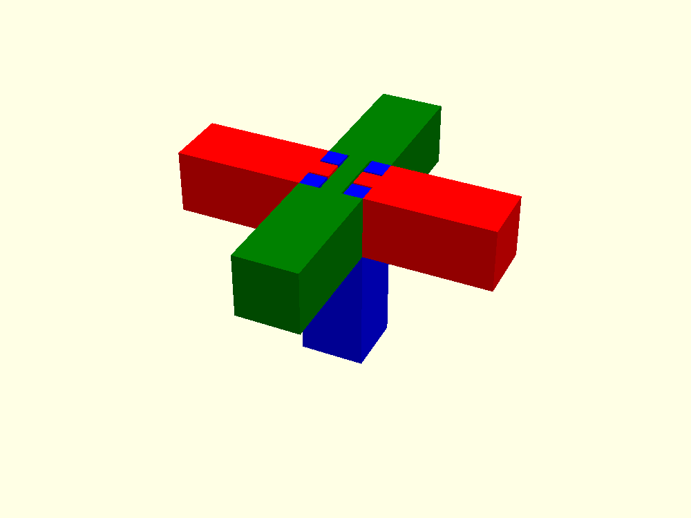
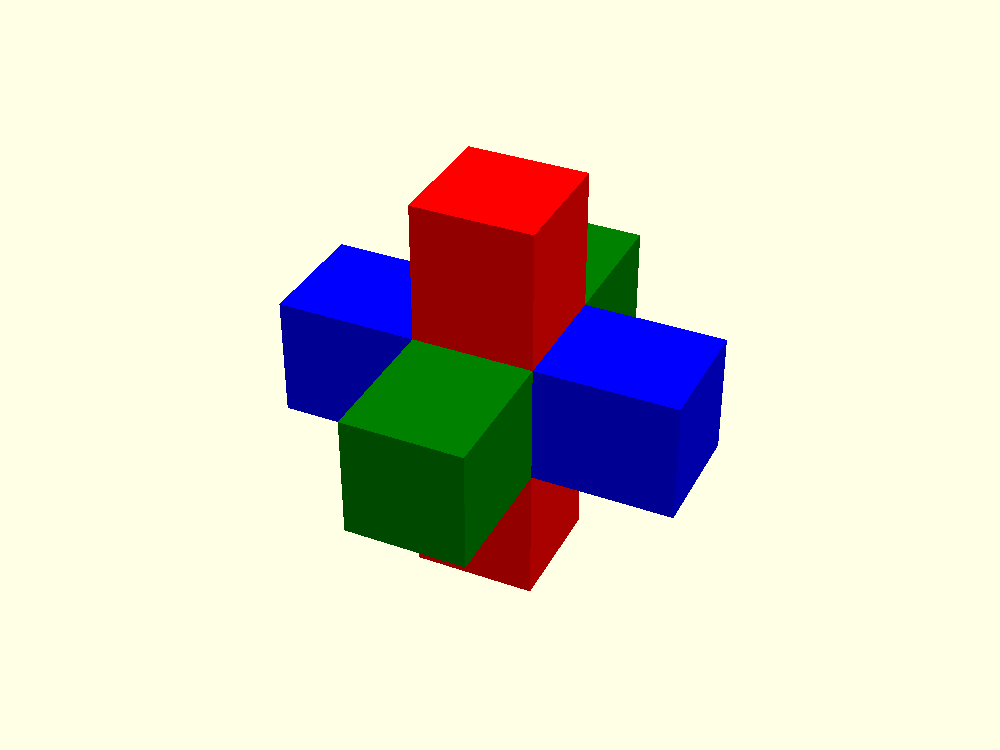
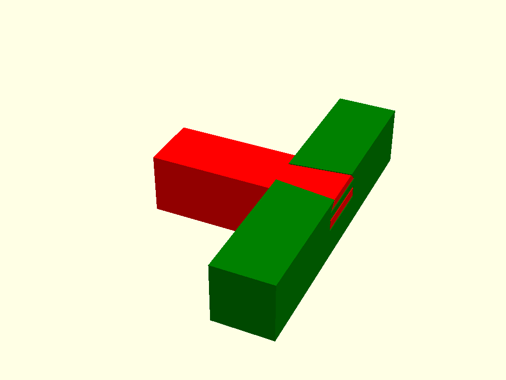
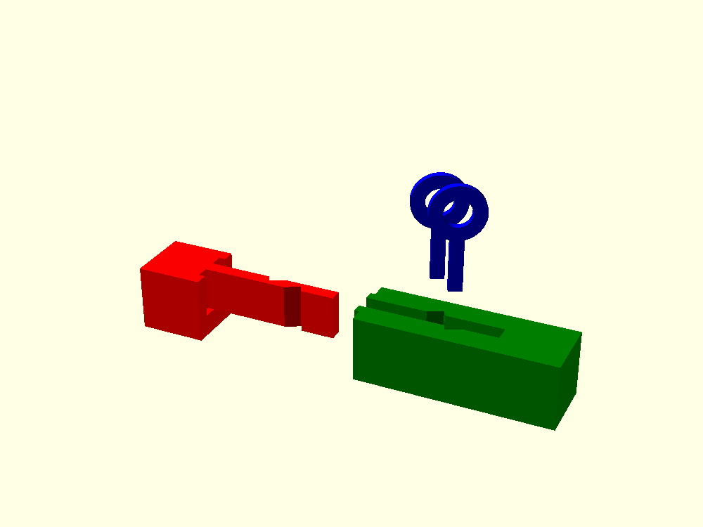
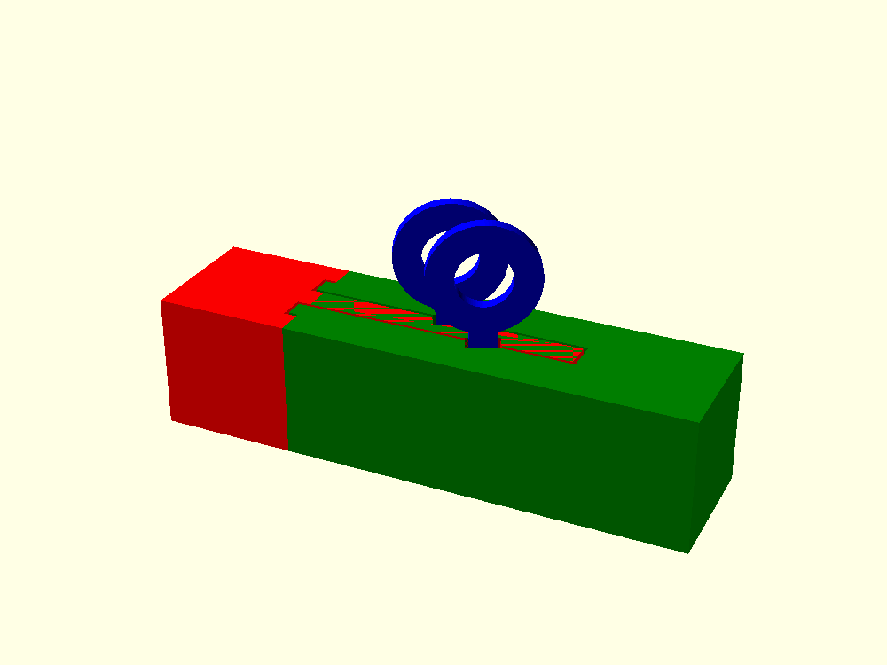

# joints

Traditional Japanese carpentry joints in OpenSCAD format.

Each model is a single `.scad` file with no dependencies. Open one in OpenSCAD, press F5 to preview or F6 to
render, then export the parts you want to print. Every model here has been rendered with OpenSCAD 2021.01.

The parts of a joint are drawn in different colors so you can tell them apart in the preview.

# Available Models

Shikuchi (仕口) joins components in perpendicular directions. Tsugite (継ぎ手) joins components in a straight line.

## 井桁仕口 Igeta Shikuchi

Three bars cross in a well-curb (井) pattern. The upright carries four stub tenons that pin the two crossing
bars together where they overlap.



## 三方仕口 Sanpou Shikuchi

Three bars meet at one corner from three directions. The model has no leeway in the joint sections, so you may
have to file the printed surfaces down a little before the parts slide together.



## 蟻ほぞ差し仕口 Ari Hozo Sashi Shikuchi

One bar meets the side of another in a T. The end of the male bar carries two stacked dovetail tenons (蟻, ari),
whose flare stops the bar from being pulled straight back out.



## 竿車知継ぎ Saoshachi Tsugi

Two bars are joined end to end. The male bar carries a long thin tenon (竿, sao) that drops into an open-top
mortise in the female bar. Two keys (車知, shachi) are then dropped in from above. Each key sits in a slanted
slot that straddles one wall of the mortise and bites into one edge of the tenon, so the tenon can no longer
pull back out. Two small tongues (目違い, mechigai) stop the joint from twisting.





The model has two variables you will want to change while working with it. Both are exposed in the OpenSCAD
Customizer.

| Variable | Values | What it does |
|----------|--------|--------------|
| `view` | `assembled`, `exploded`, `print` | Shows the joint closed, pulled apart, or laid out flat for printing |
| `part` | `all`, `male`, `female`, `key` | Limits the render to one part, so you can export it on its own |

To export one part from the command line:

```
openscad -o male.stl -D 'view="print"' -D 'part="male"' saoshachi-tsugi.scad
```

`size` sets the cross-section of both bars, and every other dimension follows from it. `leeway` is the clearance
left on each mating face, and it defaults to 2.5% of `size`. If your printer runs tight or loose, this is the
one number to adjust.

# LICENSE

[CC BY 2.0](https://creativecommons.org/licenses/by/2.0/)
